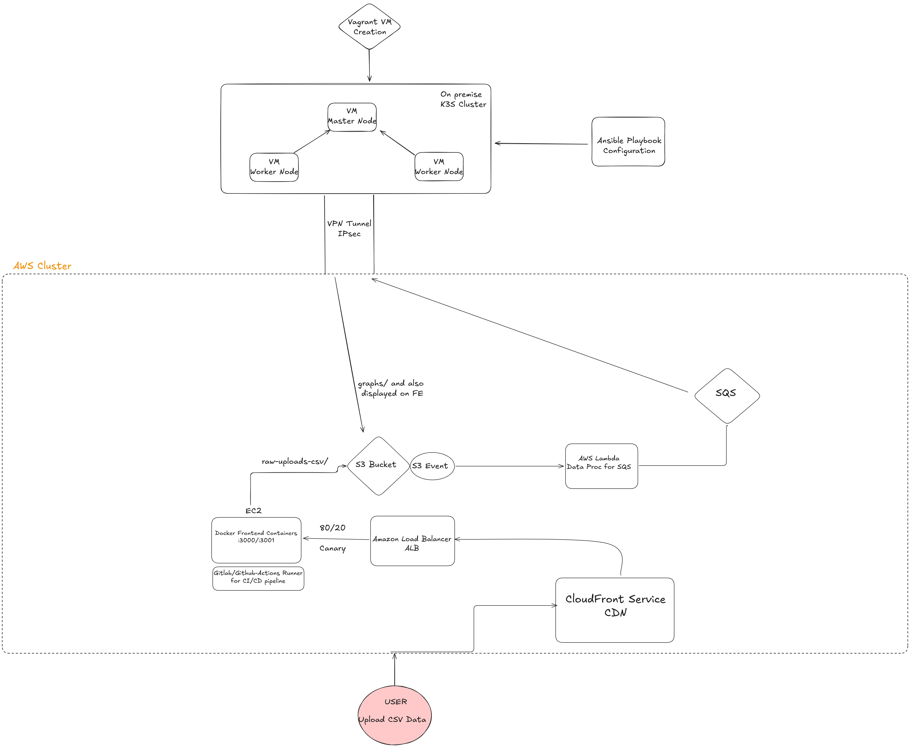

# Hybrid AWS and on-premise Kubernetes Arhitecture Project
Hybrid application on AWS and on-premise Kubernetes Cluster implementing multiple services

## Introduction
Scopul proiectului este crearea unei platforme simple care permite utilizatorilor sa incarce fisiere CSV (de exemplu, date de la senzori) si sa vizualizeze rezultatele procesarii intr-o interfata web.

## Arhitectura sistemului

### Componente AWS
- Route 53 – gestionarea domeniilor si rutarea traficului.
- Application Load Balancer (ALB) – distribuirea traficului catre instantele EC2.
- EC2 + Docker – gazduirea containerelor cu aplicatia web (frontend si backend API).
- Cognito – autentificare utilizatori.
- S3 – stocare fisiere CSV brute si rezultate procesate.
- SQS – coada pentru gestionarea joburilor de procesare.
- Lambda – functii serverless care primesc rezultatele de la worker si le prelucreaza.
- SNS – trimiterea notificarilor catre utilizatori.
- CloudWatch / Managed Prometheus & Grafana – monitorizare, loguri si dashboard-uri.

### Componente on-prem (cluster K3s) creat din 3 VM-uri Local
- Worker Deployment – proceseaza fisierele CSV primite din SQS.
- External Secrets Operator – sincronizeaza secretele din AWS Secrets Manager.
- Prometheus agent + CloudWatch agent – colecteaza metrici si loguri locale.
- Conectivitate securizata prin VPN (sau WireGuard) catre VPC-ul AWS.

## Tehnologii si instrumente folosite
- Containerizare & orchestrare: Docker, K3s.
- Cloud AWS: EC2, ALB, S3, Cognito, SQS, RDS/Aurora, SNS, CloudWatch.
- Infra-as-Code: Terraform (pentru AWS) si Ansible (pentru setup on-prem).
- CI/CD: GitHub/GitLab Actions – build imagini Docker (ECR) + deploy automat (Helm/Terraform).
- Observabilitate: Prometheus + Grafana, CloudWatch.
- Securitate: TLS, IAM, External Secrets, WAF pe ALB.

## Nota:

 - Proiectul poate suferi modificari pe parcursul dezvoltarii.
 - Pentru procesarea fisierelor CSV se poate integra un modul suplimentar de inteligenta artificiala, fie printr-un model LLM, fie utilizand bibliotecile oferite de fastai.

## Cursuri:
 - https://1and1.udemy.com/course/aws-certified-cloud-practitioner-new/learn/ 
 - https://www.fast.ai/ 
 - https://www.udemy.com/course/ultimate-aws-certified-sysops-administrator-associate/?couponCode=2021PM20#instructor-1

## My Profile:
 - https://github.com/Theeo04